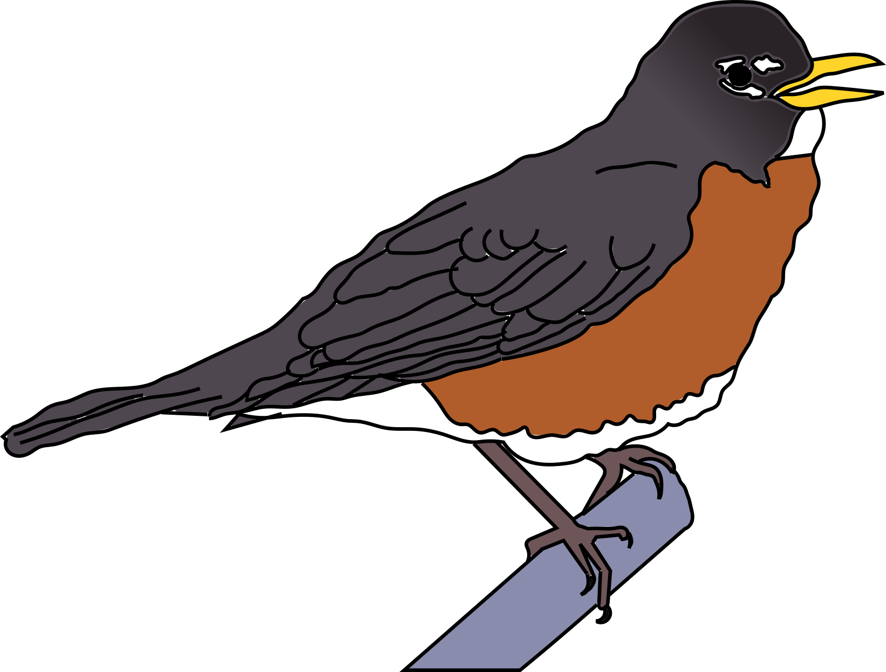
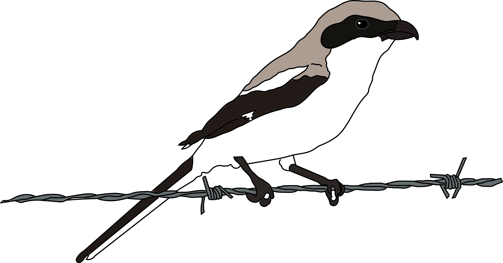
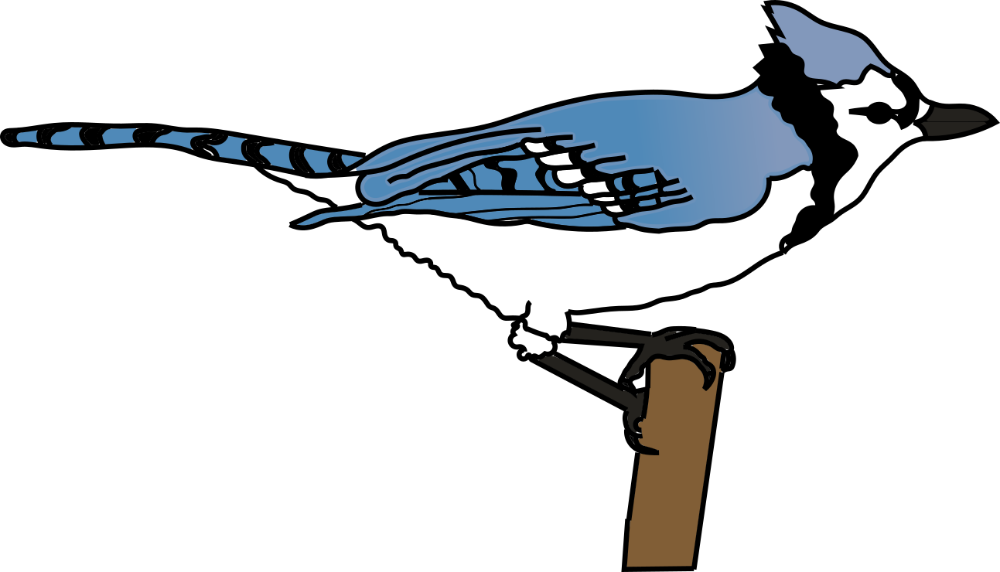
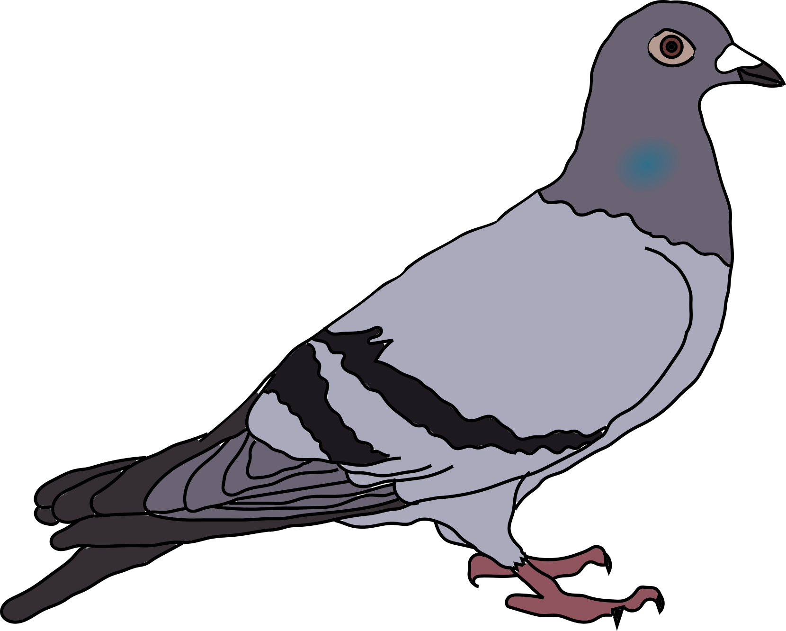

## This is the data and code for:

Bates, J. M., Fidino, M., Nowak-Boyd, L., Strausberger, B. M., Schmidt, K. A., and Whelan, C. J. (in prep). Climate change affects nesting phenology of midwestern birds: comparison of modern field records with historical records obtained from museum collections.

 <h3>Scripts</h3> 

---

**bates_2017_calc_climate_residuals.R:** This script reads in the atmospheric CO2 data, fits a linear model to it (with year as the independent variable), and calculates the residuals from the model.
These residuals are then used in our primary analysis.

**bates_2017_analysis_script.R:** This script fits our robust to outlier model to bird nesting records.

**bates_2017_plotting.R:** This script can be used to generate the figures in the manuscript.

---

 <h3>Models</h3> 

---

**This repository also has 2 JAGS models that we used for our analysis. They should be placed within the jags_models sub-folder of the working directory. These include:**

**bates_2017_climate_resid_model.R:** This is the model that is called by `bates_2017_calc_climate_residuals.R`. 

**bates_2017_robust_t_model.R:** This is the model that is called by `bates_2017_analysis_script.R`. 

---

 <h3>Data</h3> 

---

**There are three data files within the data sub-folder which are used in this analysis. They include:**

**bates_2017_co2.csv:** This is the global atmospheric CO2 levels per year. 

| Column header | Data type | Description |
|---|---|---|
| `yr`| Integer | The year the global atmospheric CO2 level is associated to. Ranges from 1744 to 2015. |
| `co2` | Numeric | The global atmospheric CO2 level on a given year. |

Between 1744 and 1953, global CO2 levels were compiled from ice cores collected at Siple Station, West Antarctica (Neftel et al. 1994). 
For 1958 to 2015, direct observations of atmospheric CO2 levels were collected from the Mauna Loa Observatory (Keeling et al. 2008).

**bates_2017_migratory_status.csv:** These data relate a species to a specific migratory group as well as its American Ornithological Union (AOU) 4-letter alpha code.

| Column header | Data type | Description |
|---|---|---|
| `cmn` | Character | The common name of a given bird species. Species names are lowercase. |
| `migstat` | Character | The migratory status of a species. `long` indicates long-distance migrants (species that spend the non-breeding season primarily in the subtropics/tropics south of the United States border). `short` indicates short-distance migrants (species that spend the non-breeding season in southern temperate regions of the southern U.S.), and `resident` indicates permanant residents (species that maintain most of their populations in the study region throughout the year). |
 |`species`| Character | The AOU 4-letter alpha code of a species. |
 
 Migatory status for all species was compiled from https://www.allaboutbirds.org/
 
 **bates_2017_bird_lay_dates.csv:** This is the lay date information for midwestern birds that were used in this analysis.
 
 | Column header | Data type | Description |
|---|---|---|
|`species`| Character | The AOU 4-letter alpha code of a species. |
|`jdate`| Integer | The julian date of the first lay date of a nest (Number of days from January 1 on a given year) |
|`year` | Integer | The year the nest was found. |
| `period` | Categorical | `low` indicates historic records housed at the Field museum of egg collections. `high` indicates current records of nest phenology colleted through comprehensive field work by Chris Whelan and Bill Strausburger.|
 

